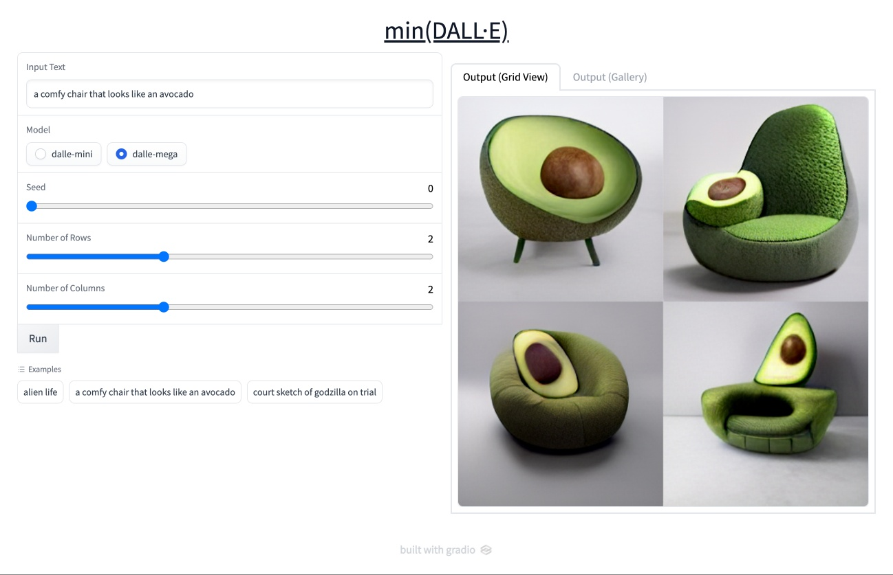
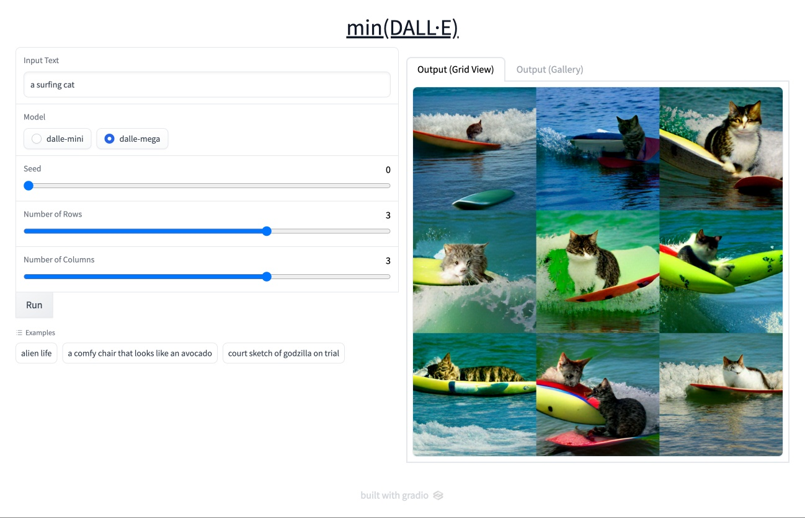
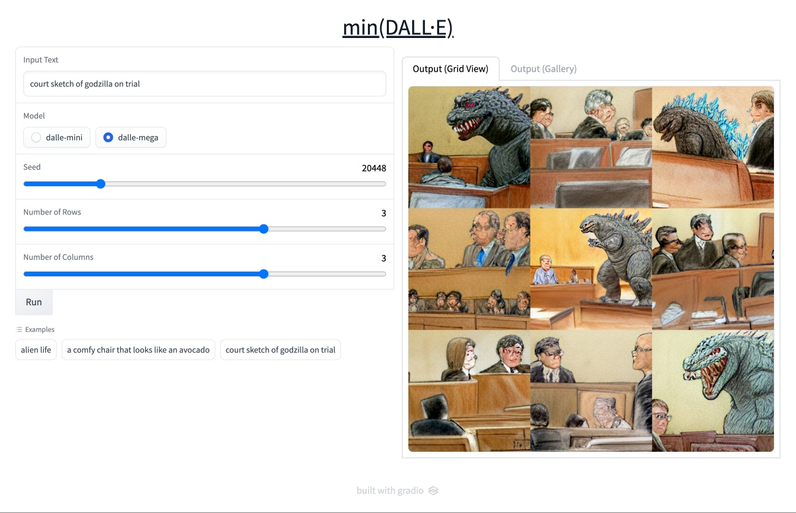

# min(DALL·E) demo
This is an unofficial demo app for [min(DALL·E)](https://github.com/kuprel/min-dalle).





## Installation
```bash
git clone --recursive https://github.com/hysts/min-dalle_demo
cd min-dalle_demo
docker compose build
```

## Download pretrained models
Follow [the instructions](https://github.com/kuprel/min-dalle#setup) of min(DALL·E) repo.

## Run
```baash
docker compose run --rm app
```
